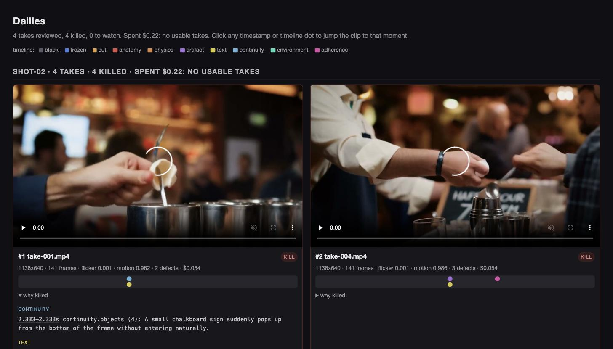

# dailies

[](https://github.com/zhang-liz/dailies/actions/workflows/tests.yml)
[](https://pypi.org/project/video-dailies/)
[](https://pypi.org/project/video-dailies/)
[](LICENSE)

**A command-line tool and agent skill that triage batches of AI-generated video takes.** It kills the dead ones with timestamped evidence, ranks the survivors, and writes one HTML morning report. Python 3.9+ and ffmpeg, zero other dependencies. Run it yourself from the shell, or let the bundled Claude Code skill run the whole morning for you.

```sh
pip install video-dailies
dailies review ./takes
dailies report ./takes -o report.html
```

It never claims a take is good; it claims most of them are definitely dead, and shows you why.

## One batch, sixty seconds

Four takes from a current video model. The prompt requires a chalkboard sign reading exactly "HAPPY HOUR 5-7PM". Two of them, playable; watch the egg and the sign:

https://github.com/user-attachments/assets/fc72ebaf-8bf8-488f-8d8e-889cbeb24b0c

https://github.com/user-attachments/assets/42b4e097-2685-4e5c-8d49-e4e546f24704

One command judges all four:

```
$ dailies review ./bar --vlm https://api.example.com/v1 \
    --vlm-model gemini-3.5-flash-lite --samples 3
reviewed 4 takes, killed 4
  kill  #1  take-001.mp4
        text.legibility severity 4 at 2.333s: The sign reads
        'HAPPY HOUR 5-5PM' instead of 'HAPPY HOUR 5-7PM'
  kill  #3  take-003.mp4
        artifact.morphing severity 4 at 3.875s: The object being held
        instantly morphs from a white egg into a black chalkboard sign
```

No take got the sign right. The morning report opens with the batch's autopsy:

[](https://multimodalsociety.com/assets/tutorial-dailies/shot-02/report)

Click through for the live report: hover to scrub, click a defect dot to jump the clip to that moment. Tonight's fix is the prompt, not another 40 seeds, and it cost 22 cents to learn that instead of an hour of scrubbing.

One more: the same run killed a take on a different batch at confidence 0.67 (two of three judge samples). We disagreed, recorded the ruling with `dailies gold add`, and `dailies fit` pushed that rule's weight negative: the judge learns whose taste is in charge.

Full walkthrough with all five batches and every output: [the tutorial](https://multimodalsociety.com/blog/overnight-dailies).

## Or let an agent run the morning

[triage-dailies](skills/triage-dailies/SKILL.md) is a Claude Code skill that drives the ritual: it summarizes the batch, shows you the defect frame behind every doubtful verdict before you rule, records your keep/kill calls as gold labels (only yours; it never labels on its own), and recalibrates the judge once your labels can carry it.

```sh
cp -r skills/triage-dailies ~/.claude/skills/
```

Then say "morning triage" in Claude Code from your takes directory.

## What else it does

Each capability is one command; the [guide](docs/GUIDE.md) has the depth.

- **Vision judge**: `--vlm` points at any OpenAI-compatible endpoint (hosted or local). Rules are yes/no evidence checklists; the model never picks a severity score. Custom rules need zero code.
- **Confidence and cascades**: `--samples 3` turns judge disagreement into per-defect confidence, and an unagreed defect cannot kill. `--vlm-strong` escalates only the unsure rules to a bigger model.
- **Your taste as ground truth**: `gold add` records your verdicts; `calibrate` sets a kill threshold with a stated false-kill rate (and refuses until it has the labels to back it); `fit` learns per-rule weights from your history; `judge-check` catches a judge or prompt change silently moving your kills.
- **Cost receipts**: `--prices` turns recorded token usage into dollars per usable take, in every report header.
- **Morning tools**: `brief` explains why a shot keeps dying, `assemble` joins the best take per shot into one slated rough cut with an EDL.
- **Overnight watch and regen**: `watch` reviews takes as they land; `--regen` resubmits kills through a driver with budget caps, futility stops, and defenses against the loop fooling its own judge.
- **Machine interface**: `--json` everywhere, `--ndjson` streaming, `verdict` answers in the exit code, `schema` prints the published contracts.

## Honest limits

Automated judgment of generated video tops out well below human agreement, and vision models miss most on synthetic-video physics. dailies is triage that saves review time, not automated quality judgment: it never says a take is good, and the `review` pile exists because a judge that cannot decide should say so. The full statement of limits is in the [guide](docs/GUIDE.md#honest-limits).

## Docs

- [The guide](docs/GUIDE.md): every feature in depth
- [SPEC.md](SPEC.md): the take.json sidecar contract
- [docs/DRIVERS.md](docs/DRIVERS.md): the regen driver contract
- [docs/ROADMAP.md](docs/ROADMAP.md): what ships next
- [CHANGELOG.md](CHANGELOG.md): what changed per release
- [CONTRIBUTING.md](CONTRIBUTING.md): ground rules and setup
- [The tutorial](https://multimodalsociety.com/blog/overnight-dailies): a worked morning, with footage

## Tests

```sh
python3 -m unittest discover tests
```

Tests generate synthetic clips with ffmpeg and assert the funnel's verdicts.
